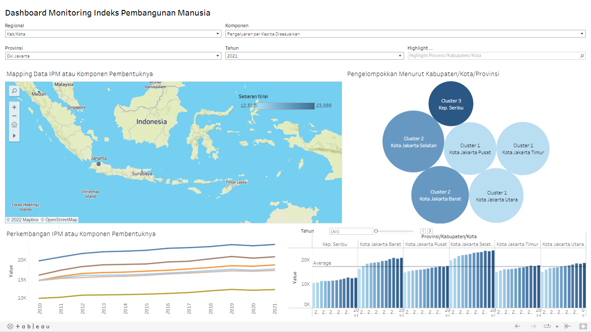

<!--
*** Thanks for checking out the Best-README-Template. If you have a suggestion
*** that would make this better, please fork the repo and create a pull request
*** or simply open an issue with the tag "enhancement".
*** Don't forget to give the project a star!
*** Thanks again! Now go create something AMAZING! :D
-->

<!-- PROJECT SHIELDS -->
<!--
*** I'm using markdown "reference style" links for readability.
*** Reference links are enclosed in brackets [ ] instead of parentheses ( ).
*** See the bottom of this document for the declaration of the reference variables
*** for contributors-url, forks-url, etc. This is an optional, concise syntax you may use.
*** https://www.markdownguide.org/basic-syntax/#reference-style-links
-->

<!-- ABOUT THE PROJECT -->
## Dashboard Monitoring Indeks Pembangunan Manusia

Project ini merupakan dokumentasi dashboard monitoring yang dibangun menggunakan Tableau Public yang dapat diakses melalui link berikut. 

(<a href="https://public.tableau.com/app/profile/fathonah.illia/viz/DashboardMonitoringIPM/DashboardMonitoring">Dashboard Monitoring IPM</a>)

### Dataset

Dataset berupa data IPM dan komponen penyusunnya yang digunakan berasal dari website BPS (<a href="https://www.bps.go.id/">Website BPS</a>) dan kewilayahannya diperoleh dari (<a href="https://github.com/yusufsyaifudin/wilayah-indonesia/tree/master/data/list_of_area">https://github.com/yusufsyaifudin</a>) . Data yang diambil merupakan data runtun waktu dari  tahun 2010 sampai 2021. Adapun data yang akan digunakan adalah indeks pembangunan manusia, umur harapan hidup saat lahir (UHH), rata-rata lama sekolah, pengeluaran per Kapita disesuaikan, dan harapan lama sekolah yang semua level datanya pada tingkat kabupaten/kota.

